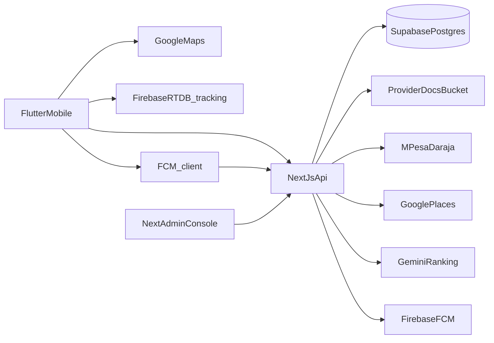

# S-Link Architecture Overview

Current **end-to-end** implementation in this repository.

## High-level system

- **Frontend:** Flutter app in `mobile/` (Android primary; iOS keys present for mic/speech).
  - `dio` → Next.js `/api`
  - `go_router`, `speech_to_text`, `google_maps_flutter`
  - Firebase Realtime Database for some live tracking paths
  - **FCM** for provider job offers / broadcasts (`PushNotificationService`)
- **API:** Next.js App Router in `web/` (Flutter-compatible shapes).
  - Demo mode: in-memory store
  - Production: Supabase service role (`DEMO_MODE=false`)
  - AI dispatch + FCM when Gemini + Firebase Admin are configured
- **Data:** SQL migrations in `supabase/migrations/` (`001`…`014`)
- **Legacy:** Django in `backend/` — reference only; do not treat as the live API

## Roles

### Customer
- Register with terms acceptance
- Search / voice intent → **job pin** → recipient → **describe problem** → discovery pay → ranked providers → job
- Track provider to the pinned site; rate on completion; file complaints

### Provider
- Register + KYC onboarding (ID/passport photo required; good conduct optional)
- Places-based area of operation; terms acceptance
- Register FCM token for job push notifications
- Await admin verification before taking jobs (gatekeeping)
- Accept jobs, navigate to pin, heartbeat / location updates, complete work

### Admin
- Next.js `/admin`: live map, providers (verify/suspend + KYC detail/docs), jobs, payments, ads, complaints, **terms**, **access allowlist**, **Kenya data quality**

## Matching & dispatch

Distance is measured from the **job pin** to provider live heartbeat (if fresh) or base location. Providers are **sorted/scored** by distance and quality signals (Gemini ranking when configured). Hard radius geofencing is not applied.

Dispatch flow: rank → notify #1 via FCM → on timeout, broadcast to remaining candidates.

## Key tables (simplified)

- `profiles`, `service_categories`, `service_provider_profiles` (+ KYC/area fields)
- `provider_legal_documents` (+ `document_type`, review status)
- `job_requests` (+ recipient/pin fields + dispatch timestamps)
- `discovery_payments`, `payments`, `provider_locations`, `ratings`
- `terms_versions`, `user_terms_acceptances`
- `complaints`
- `provider_device_tokens`, `job_dispatches` (FCM / AI dispatch)
- `admin_allowlist`

## Security notes

- Service-role key stays server-side only
- Provider docs bucket is private
- No fingerprint/biometric templates are collected or stored
- Recipient phone disclosure: after accept for providers
- Admin Google login requires allowlisted email
- FCM payloads carry `job_id` + type only (no PII in notification data)
